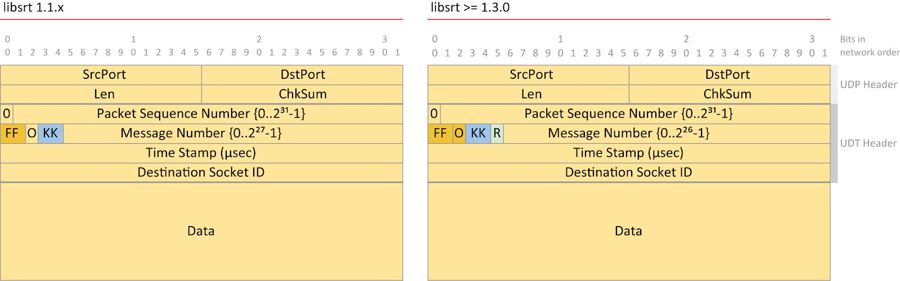
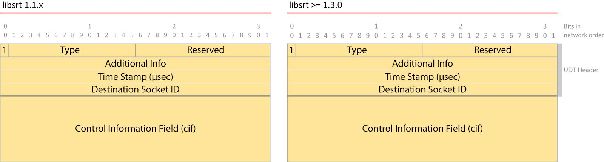

# Packet Structure **数据包结构**

SRT maintains UDT‘s UDP packet structure, but with some modifications. Refer to Section 2 of the UDT IETF Internet Draft (draft-gg-udt-03.txt) for more details.

SRT 保留了 UDT 的 UDP 数据包结构，但进行了一些修改。有关更多详细信息，请参阅 UDT IETF Internet 草案（draft-gg-udt-03.txt）的第 2 节。

## Data and Control Packets 数据与控制包

Every UDP packet carrying SRT traffic contains an SRT header (immediately after the UDP header). In all versions, the SRT header contains four major 32-bit fields:

每个承载 SRT 流量的 UDP 数据包都包含一个SRT标头（紧随 UDP 标头之后）。在所有版本中，SRT 包头都包含四个主要的 32 位字段：

* PH_SEQNO
* PH_MSGNO
* PH_TIMESTAMP 
* PH_ID

SRT has two kinds of packets, where the first bit in the PH_SEQNO field in the packet header distinguishes between data (0) and control (1) packets. Below, for example, is a representation of an SRT ​data​​ packet header (where the “packet type” bit = 0):

SRT 有两种包，其中数据包头中 PH_SEQNO 字段的第一位区分数据（0）数据包和控制（1）数据包。 例如，以下是 SRT 数据包头的表示形式（其中“包类型”位 = 0）：

> NOTE​​: ​Changes in the packet structure were introduced in SRT version 1.3.0. For the purpose of promoting compatibility with earlier versions, old and new packet structures are presented here. Packet diagrams in this document are in network bit order (big-endian). **包结构的更改是在 SRT 版本 1.3.0 中引入的。为了促进与早期版本的兼容性，此处介绍了新旧数据包结构。本文档中的数据包图按网络位顺序（大端序）排列。**

* **FF​**​ = (2 bits) Position of packet in message 表示数据包在消息中的位置, where:
    * 10b = 1st 第一个
    * 00b = middle 中间
    * 01b = last 最后一个
    * 11b = single 独立包
* **O​**​ = (1 bit) Indicates whether the message should be delivered in order (1) or not (0). In File/Message mode (original UDT with UDT_DGRAM) when this bit is clear then a message that is sent later (but reassembled before an earlier message which may be incomplete due to packet loss) is allowed to be delivered immediately, without waiting for the earlier message to be completed. This is not used in Live mode because there‘s a completely different function used for data extraction when TSBPD mode is on. 表示是（1）否（0）应按顺序传递消息。 在文件/消息模式（带 UDT_DGRAM 的原始 UDT）中，当该位清零时，允许立即发送稍后发送的消息（但在先前的消息之前重新组合，由于消息丢失，该消息可能不完整），而无需等待 较早的消息要完成。在实时模式下不使用此功能，因为在打开 TSBPD 模式时，用于数据提取的功能完全不同。
* **KK​**​ = (2 bits) Indicates whether or not data is encrypted: 表示是否应该加密
    * 00b: not encrypted 不加密
    * 01b: encrypted with even key 用偶数密钥加密
    * 10b: encrypted with odd key 用奇数密钥加密
* **R**​​ = (1 bit) Retransmitted packet. This flag is clear (0) when a packet is transmitted the very first time, and is set (1) if the packet is retransmitted. 重发的数据包。第一次发送数据包时，此标志清除（0），如果重新传输数据包，则设置（1）

In Data packets, the third and fourth fields are interpreted as follows:

在数据包中，第三和第四字段的解释如下：

* **TIMESTAMP**: Usually the time when a packet was sent, although the real interpretation may vary depending on the type. 通常代表发送数据包的时间，尽管实际解释可能会因类型而异。
* **ID**: The Destination Socket ID to which a packet should be dispatched, although it may have the special value 0 when the packet is a connection request. 数据包应发送到的目标 Socket ID，尽管当该数据包是连接请求时它可能具有特殊值 0

Additional details for Data packets are discussed later in this document.

An SRT ​control​​ packet header (“packet type” bit = 1) has the following structure (UDP header not shown):

For Control packets the first two fields are interpreted respectively (using network bit order) as:

* Word 0:
    * Bit 0: packet type (set to 1 for control packet)
    * Bits 1-15: Message Type
    * Bits 16-31: Message Extended type

    | Type | Extended | Type Description |
    | :------: | :------: | :------ |
    | 0 | 0 | HANDSHAKE |
    | 1 | 0 | KEEPALIVE |
    | 2 | 0 | ACK |
    | 3 | 0 | NAK (Loss Report) |
    | 4 | 0 | Congestion Warning  |
    | 5 | 0 | Shutdown |
    | 6 | 0 | ACKACK |
    | 7 | 0 | Drop Request |
    | 8 | 0 | Peer Error |
    | 0x7FFF | - | Message Extension |
    | 0x7FFF | 1 | SRT_HSREQ: SRT Handshake Request |
    | 0x7FFF | 2 | SRT_HSRSP: SRT Handshake Response |
    | 0x7FFF | 3 | SRT_KMREQ: Encryption Keying Material Request |
    | 0x7FFF | 4 | SRT_KMRSP: Encryption Keying Material Response |

    The Extended Message mechanism is theoretically open for further extensions. SRT uses some of them for its own purposes. This will be referred to later in the section on the SRT Extended Handshake. 理论上，扩展消息机制对进一步扩展是开放的。SRT 将其中一些用于自己的目的。 稍后将在“SRT 扩展握手”部分中对此进行介绍。

* Word 1:
    * Additional info — used in some control messages as extra space for data. Its interpretation depends on the particular message type. Handshake messages don‘t use it. 其他信息，在某些控制消息中用作额外的数据空间。其解释取决于特定的消息类型。握手消息不使用它。

