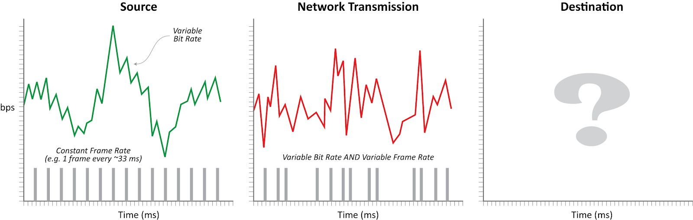
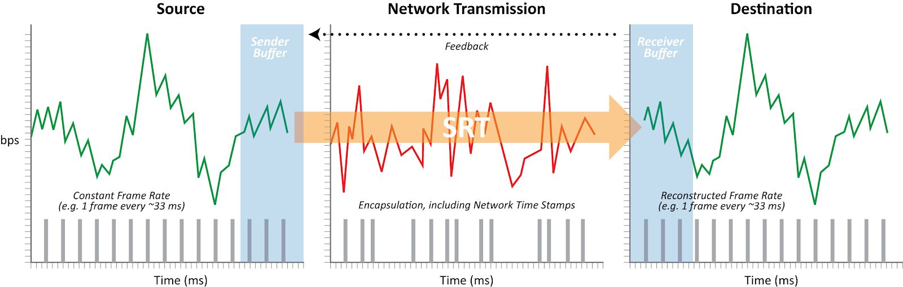

# SRT_CHS

[SRT Protocol Technical Overview](https://github.com/Haivision/srt/files/2489142/SRT_Protocol_TechnicalOverview_DRAFT_2018-10-17.pdf) 中文翻译项目

> 本项目使用中英文对照的方式呈现，方便读者随时查找原文。如果你希望加入项目，欢迎认领章节；如果发现有翻译问题，欢迎提交 PR。

Derived from the UDP-based Data Transfer protocol, SRT is a user-level protocol that retains most of the core concepts and mechanisms while introducing several refinements and enhancements, including control packet modifications, improved flow control for handling live streaming, enhanced congestion control, and a mechanism for encrypting packets. This document describes the SRT protocol itself. A fully functional reference implementation can be found at [https://github.com/Haivision/srt](https://github.com/Haivision/srt).

SRT源自基于UDP的数据传输协议，是一种用户级协议，它保留了大多数核心概念和机制，同时引入了一些改进和增强功能，包括控制包修改，用于处理实时流的改进流控制，增强的拥塞控制， 以及一种加密数据包的机制。 本文档介绍了SRT协议本身。你可以在 [https://github.com/Haivision/srt](https://github.com/Haivision/srt) 找到功能齐全的参考实现。

## Introduction 介绍

SRT is a transport protocol that enables the secure, reliable transport of data across unpredictable networks, such as the Internet. While any data type can be transferred via SRT, it is particularly optimized for audio/video streaming.

SRT 是一种传输协议，支持跨不可预测的网络（例如 Internet ）安全，可靠地传输数据。 尽管可以通过 SRT 传输任何数据类型，但它特别针对音频/视频流进行了优化。

SRT can be applied to contribution and distribution endpoints as part of a video stream workflow to deliver the best possible quality and lowest latency video at all times.

SRT 可以作为视频流工作流的一部分应用于贡献和分发端点，以始终提供最佳质量和最低延迟的视频。

As packets are streamed from a source to a destination device, SRT detects and adapts to the real-time network conditions between the two endpoints. SRT helps compensate for jitter and bandwidth fluctuations due to congestion over noisy networks. Its error recovery mechanism minimizes the packet loss typical of Internet connections. And SRT supports AES encryption for end-to-end security.

当数据包从源流向目标设备时，SRT 会检测并适应两个端点之间的实时网络状况。SRT 有助于补偿由于噪声网络拥塞而引起的抖动和带宽波动。它的错误恢复机制最大程度地减少了 Internet 连接中典型的数据包丢失。SRT 支持 AES 加密以实现端到端安全性。

SRT has its roots in the UDP-based Data Transfer (UDT) protocol. While UDT was designed for high throughput file transmission over public networks, it does not do well with live video. SRT is a significantly modified version that supports live video streaming.

SRT 起源于基于 UDP 的数据传输（UDT）协议。尽管 UDT 是为通过公共网络进行高吞吐量文件传输而设计的，但它与实时视频的效果并不理想。SRT 是经过重大修改的版本，支持实时视频流。

Low latency video transmission across IP based networks typically takes the form of MPEG-TS unicast or multicast streams using the UDP protocol. This solution is perfect for protected networks, where any packet loss can be mitigated by enabling forward error correction (FEC). Achieving the same low latency between sites in different cities, countries or even continents is more challenging. While it is possible with satellite links or dedicated MPLS networks, these are expensive solutions. The use of cheaper public internet connectivity, while less expensive, imposes significant bandwidth overhead to achieve the necessary level of packet loss recovery.

基于 IP 的网络上的低延迟视频传输通常采用 UDP 协议的 MPEG-TS 单播或多播流形式。该解决方案非常适合受保护的网络，通过启用前向纠错（FEC）可以减轻任何数据包丢失。在不同城市，国家甚至大洲的站点之间实现相同的低延迟更具挑战性。虽然卫星链接或专用 MPLS 网络是可能的，但这些都是昂贵的解决方案。使用较便宜的公用 Internet 连接，虽然价格较便宜，但会带来相当大的带宽开销，以实现必要水平的丢包恢复。

Even though UDT was not designed for live streaming, its packet loss recovery mechanism provided an interesting starting point. The original version of SRT included new packet retransmission functionality that reacted immediately to packet loss to enable live streaming.

即使 UDT 不是为实时流而设计的，其丢包恢复机制还是一个有趣的起点。SRT 的原始版本包括新的数据包重传功能，可对数据包丢失立即做出反应以启用实时流。

To achieve low latency streaming, SRT had to address timing issues. The characteristics of a stream from a source network are completely changed by transmission over the public internet, which introduces delays, jitter, and packet loss. This, in turn, leads to problems with decoding, as the audio and video decoders do not receive packets at the expected times. The use of large buffers helps, but latency is increased.

为了实现低延迟的流传输，SRT 必须解决时序问题。 通过公共互联网进行传输会完全改变源网络中流的特性，从而导致延迟，抖动和数据包丢失。反过来，这会导致解码问题，因为音频和视频解码器不会在预期的时间接收数据包。使用大缓冲区有帮助，但是延迟增加了。

SRT includes a mechanism that recreates the signal characteristics on the receiver side, dramatically reducing the need for buffering. This functionality is part of the SRT protocol itself, so once data comes out of an SRT connection on the receiver side, the stream characteristics have been properly recovered.

SRT 包含一种在接收器端重新创建信号特性的机制，从而大大减少了缓冲需求。此功能是 SRT 协议本身的一部分，因此，一旦接收方从 SRT 连接中得到数据，流特性便已正确恢复。

Initially developed by Haivision Systems Inc., the SRT protocol was released as open source in April 2017 in partnership with Wowza Media Systems Inc. Open source SRT is distributed under MPL-2.0, which was chosen because it strikes a balance between driving adoption for open source SRT, while encouraging contributions to improve upon it by the community of adopters. Any third party is free to use the SRT source in a larger work regardless of how that larger work is compiled. Should they make source code changes, they would be obligated to make those changes available to the community.

SRT 协议最初由 Haivision Systems Inc. 开发，于 2017 年 4 月与 Wowza Media Systems Inc. 合作以开源形式发布。SRT 协议是基于 MPL-2.0 发行的，因为它在推动开放与鼓励使用者对社区做出贡献之间取得了平衡。任何第三方都可以免费地在大型项目中使用 SRT 代码，而无需担心这些代码是如何参与编译的。但是如果他们更改了源代码，则他们有义务向社区提供这些更改。

In May 2017, Haivision and Wowza founded the SRT Alliance ([www.srtalliance.org](www.srtalliance.org)), a consortium dedicated to the continued development and adoption of the protocol.

2017 年 5 月，Haivision 和 Wowza 成立了 SRT 联盟（[www.srtalliance.org](www.srtalliance.org)），该联盟致力于继续开发和采用该协议。

## Table of Contents 目录

### Adaptation of UDT4 to SRT Packet Structure 从 UDT4 到 SRT 数据包结构的改进

### Data and Control Packets Handshake Packets
* KM Error Packets
* ACK Packets
* Keep-alive Packets
* NAK Control Packets
* SHUTDOWN Control Packets ACKACK Control Packets
* Extended Control Message Packets

### SRT Data Exchange

### SRT Data Transmission and Control
* Buffers
* Send Buffer Management
* SRT Buffer Latency
* SRT Sockets, Send List & Channel 
* Packet Acknowledgement (ACKs) 
* Packet Retransmission (NAKs) 
* Packet Acknowledgment in SRT 
* Bidirectional Transmission Queues 
* ACKs, ACKACKs & Round Trip Time 
* Drift Management
* Loss List

### SRT Packet Pacing
* Packet Probes

### The Sender‘s Algorithm

### The Receiver‘s Algorithm

### Loss Information Compression Scheme UDP Multiplexer

### Timers

### Flow Control

### Configurable Congestion Control (CCC) 
* CCC Interface
* Native Control Algorithm

### SRT Encryption 
* Overview
* Definitions
* Encryption Process Walkthrough
* Messages
* Parameters
* Security Issues
* Implementation Notes

### SRT Handshake
* Overview
* Handshake Structure
* The “Legacy” and “SRT Extended” Handshakes
* The Caller-Listener Handshake 
* The Rendezvous Handshake
* The SRT Extended Handshake
* SRT Extension Commands 
* SRT Congestion Control
* Stream ID (SID)

### Sample Implementation — HSv4 (Legacy) Caller/Listener Handshake with SRT Extensions

### Terminology 

### References
* SRT Alliance 
* SRT on GitHub 
* UDT 
* Encryption